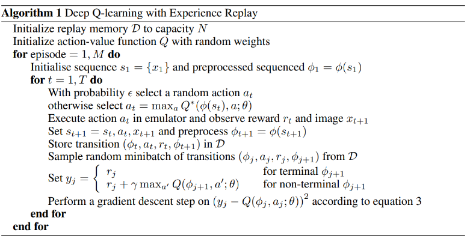
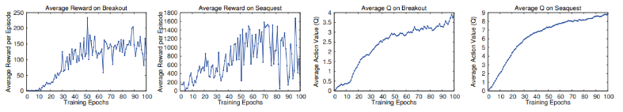

# Day 2 of Summarizing AI papers: Playing Atari with Deep Reinforcement Learning (7/19/22)

The paper that hyped up a whole generation of people and new advances in reinforcement learning, Deepmind applies deep Q-learning to seven classic Atari games. The brilliance of their model lies in the fact that they did not adjust the architecture or learning algorithm in each game. Published in 2013, their model outperformed all previous approaches in six of seven games and surpassed humans in three. 

This paper was motivated by use cases that were common, but that had difficulty in navigating the sparse, noisy, and delayed rewards often found in the real world. The challenge also comprises of tackling a large visual input (210x160 RGB at 60 Hz).

One important thing to note is that the model only has the information that we would know playing the game: the screen, reward, terminal, and set of possible actions. Since our inputs can just be represented as a sequence of actions, and observations, we get a finite Markov decision process (MDP), suggesting to use standard RL methods for MDP’s. As such, the Deepmind team uses Q-learning and the Bellman equation. Let $\gamma$ be a discount factor such that at each future time step $t’$, the reward earned at $t’$ is multiplied by $\gamma^{t-t’}$.

Let $Q^*(s,a)$ be the maximum expected reward at sequence s and with taking action a. Thus to maximize reward, the Bellman equation states: $Q^*(s,a) = reward + \gamma*max(Q*(s’,a’)$. Now, with a good Q* reward predictor function, we can predict the best actions to take.

One common strategy to better fit your $Q^*$ function is to explore and exploit strategically. To be clear, to exploit would be to take the action of highest $Q^*$ value, and vice-versa for exploration. Here, we let $\epsilon$ be the probability to explore, with $\epsilon$ slowly converging to 0.

A unique idea here is also Deepmind’s use of a replay buffer. This allows better analysis of specific game states and better randomization and “smoothness” of the function.  Shown below is their implementation with the replay buffer.

Now, I should probably mention how we represent the $Q^*$ function lol. We use a small neural network that translates our visual input into an output. The input network is an 84x84x4 image with first and second layers of 16 8x8 and 32 4x4 filters respectively with a final hidden later of 256 rectifier units. The final output later corresponded to between 4 and 18 actions depending on the game. Results are below.

Conclusion: using only raw pixels, the paper utilizes Q-learning, batching, and replay memory to train deep networks for RL.

