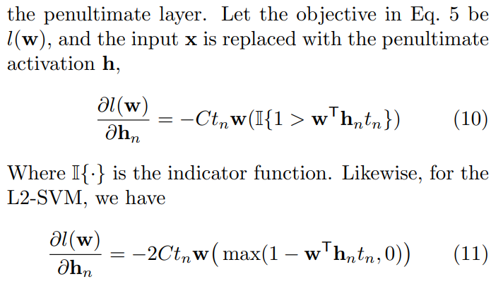
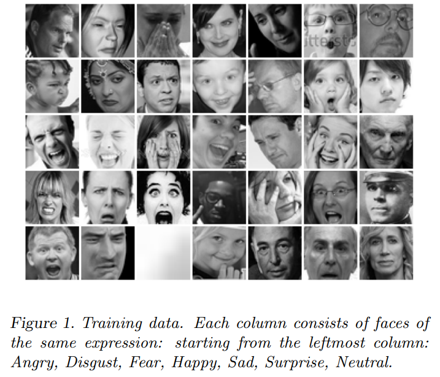

# Day 3 of Summarizing AI papers: Deep Learning using Linear Support Vector Machines (7/20/22)

This was a short paper describing results in using a support vector machine (SVM) instead of the soft-max layer in deep learning models. 

Feeding the hidden variables of a convolutional net into a linear or kernel SVM has been tried to varying degrees of success before, but this paper attempts to find for which deep architectures, a linear SVM layer could be beneficial.

## What are SVM’s?
SVM’s are classifiers that draw a hyperplane to differentiate between two classes (binary). It uses the gaussian multivariate distributions of already classified points to draw a linear hyperplane that allows new points to be classified based on the side of the hyperplane they are on. For non-linear classifications, the kernel trick is used to transform the data by some function. 

The paper dives into minimizing a constrained optimization, which does so by differentiating the SVM objective with respect to the penultimate layer.

The final minimization equations are shown below.

For their implementation, they entered into a Kaggle competition hosted by ICML. The competition tested classifying 28,000+ 48x48 images of 7 different face expressions. As the winning solution, they were able to correctly classify 71.2% of hidden tests, with only human performance to be estimated at 65-68%. They were also able to find similar success in the MNIST and CIFAR-10 datasets.

Conclusion SVM’s are incredibly easy to use vs. softmax and beneficial in certain cases. More, better research is needed.

