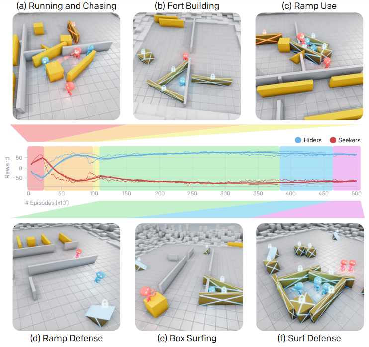

# Day 4 of Summarizing AI papers: Emergent Tool use from Multi Agent AutoCurricula (7/21/22)

I remember watching this video years ago and I think it was the first AI I was deeply intrigued by. Like wow, that’s crazy that we can do that now. Anyways, this paper is one of the coolest introductions to co-evolution between two competing organisms.

In a complex world where researchers don’t want to be bound by explicit reward functions, this paper shows that having adversarial networks compete is quite effective in being applied to more “real-world” situations.

The paper simulates the children’s game of hide and seek. The seeker’s reward function is based on the time spent that the hider is in their fov. The hider seeks to minimize this time. They spawn in a randomly generated 2-d plane with obstacles including both moveable and immovable walls, cubes, and ramps. Before the game begins, the hiders have a preparation phase allowing them to run away or quickly change their environment. As for the implementation, the game uses the MUJOCO physics engine.

Mainly, agent policies consist of two separate networks, which each produce an action distribution such as movement, grabbing, or locking. The networks are trained centrally, but execution of the games use Open AI’s rapid, the RL framework for large scale computation. Somehow, boxes and ramps are also encoded in this architecture. 

Results:
The paper categorized gameplay into six stages of emergent behavior. The agents initially running and chasing evolves into using boxes and fort building.

However, hiders then figure out to use ramps to go over walls. Ramp defense (locking ramps in place) + box surfing (abusing physics engine) emerge. The researchers say they did not actually expect box surfing to emerge as a behavior, but I’m a bit skeptical of that lol. 

