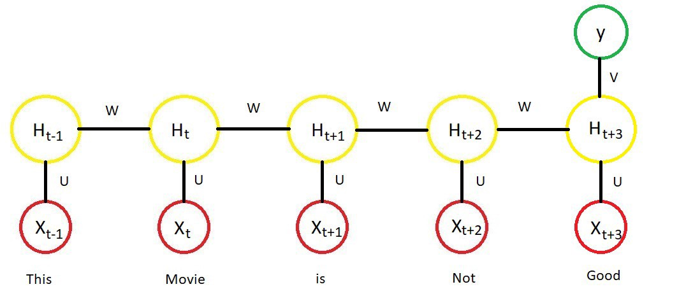
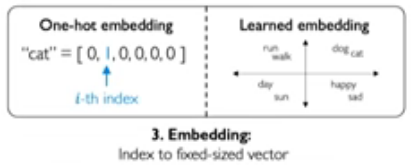
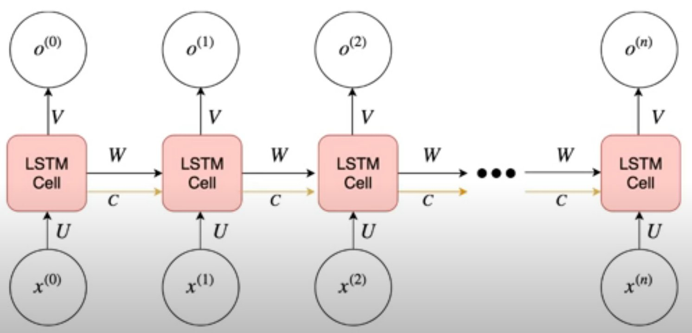

# Day 5 of Summarizing AI papers: Long Short Term Memory (7/22/22)

In order to get into Long Short-Term Memory, we need some background in RNN’s first.

Imagine trying to build a predictive algorithm that takes in the beginning of a sentence and outputs the final word. Ex: My dog wags his __. Here, building a model does not just rely on the last word, but the whole previous sentence!

RNN’s solve this by utilizing a function that repeatedly takes in both the word and some state matrix, and at each time step, the predicted word and current state matrix is updated. Basically, the model iteratively stores information it deems important into the state and uses the whole state to predict future words. Real applications that use this sequential modeling includes Natural Language Processing(NLP) and music composition.

## Representing words as numbers

Our model unfortunately can only deal with numbers and not words, though. A simple solution to “embed” words into numbers is to have a word bank of all words that are mapped to a specific index. The vector for a word is then represented as [0, 0,…,1, …,0]. This is surprisingly pretty good, but for modern solutions, another model is trained to categorize this embedding more efficiently. 

## Training the model

As with neural networks, our RNN uses a version of backpropagation to update the model’s weights and biases. Since we iteratively pass in a new word at each timestep, we have to do the same thing backwards with out RNN. This is called Backpropagation Through Time (BPTT). Problems for reference with this though is exploding and disappearing gradients. Think of it as an exponential function and so gradients either get way too big or way too small. Solutions include a better activation function, initializing our gradients better, and gate cells that selectively filter. These gated cells and special LSTM's are what I will dive into tomorrow.

