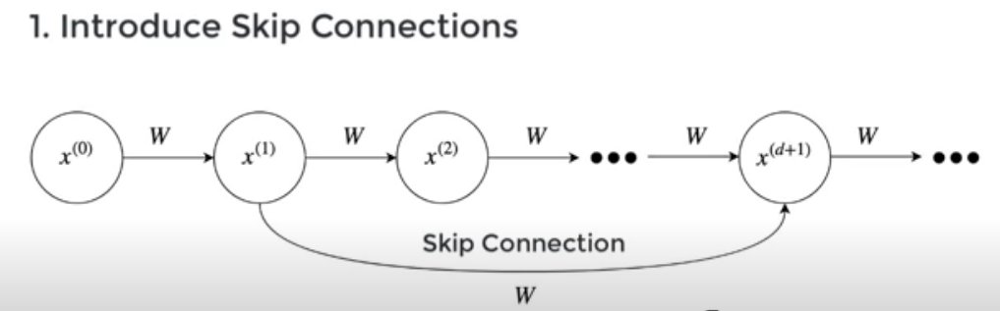
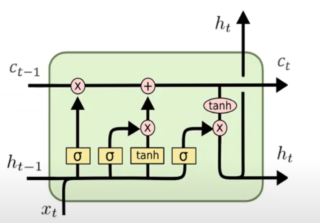

# Day 6 of Summarizing AI papers: Long Short Term Memory (7/23/22)

To understand why Long Short Term Memory(LSTM) is useful for RNN’s, let’s remind ourselves of the problems of traditional RNN’s.

1. Exploding/Vanishing gradients: since gradients are being backpropagated throughout the whole RNN structure, these gradients quickly converge to 0 or become insanely large. This is no good for updating our model.
2. Useless states: in pieces of text, for example, there are lots of filler words such as “the”, “a”, or “for.” These cloud up the model and make BPTT more challenging.

## How LSTM’s are better:

Originally, RNN’s are a very long chain where each state is only reachable from the previous state. Thus, the paper introduces a bridging mechanism, where nodes from in excess of 1000 timesteps before can reach the current node.

Specifically, the state of the current node utilizes information from the states of nodes separated by a large time gap. We can do this without losing lag features with an efficient, gradient-based algo that enforces a constant error flow.

This means we can backpropagate without having to deal with the exploding/vanishing problem.

## Naive approach (3.2):

The naive approach to constant error flow is just to set f’(net(t))w_(jj) = 1.0. Due to certain problems such as input weight conflict and output weight conflict described further in the paper, the naive approach does not work too well.

## Architecture 

The architecture that better facilitates constant error flow is a memory cell. Each memory cell has a central linear unit (CEC) and multiplicative input and output gates.

Pictured are the sigmoid and tanh activation functions that then get passed to gates. Basically, the main idea here is that each cell uses gates and activation functions to better control what information they should save to state, how much of the state they should forget, and inputs to the output. The real efficiencies here lie in being able to determine which nodes are important and deserve “attention” and which ones can be bridged over.

