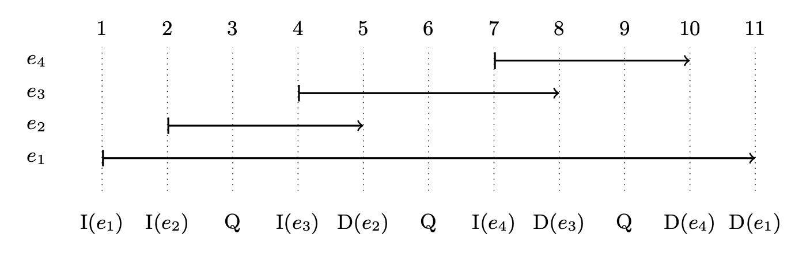
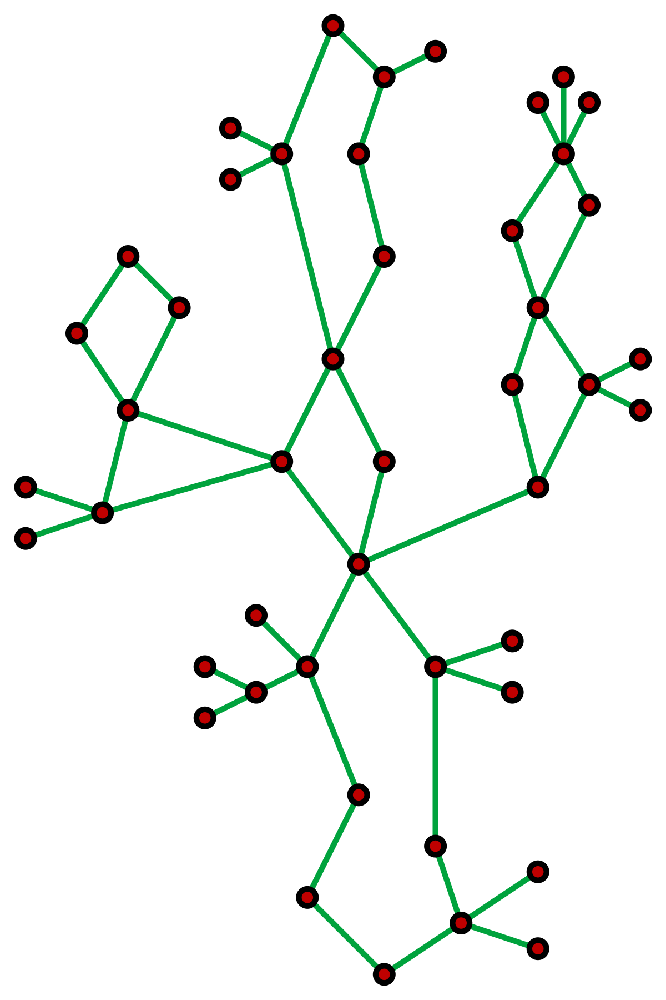
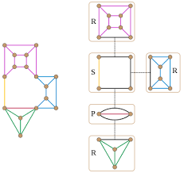

- [Day 9 of Summarizing a Paper a Day: Optimal Offline Dynamic 2/3 Edge/Vertex Connectivty](#day-9-of-summarizing-a-paper-a-day-optimal-offline-dynamic-23-edgevertex-connectivty)
  - [Background](#background)
  - [Past Papers](#past-papers)
  - [Offline Framework](#offline-framework)
  - [Constructing equivalent graphs](#constructing-equivalent-graphs)
  - [Extending to 3-Edge Connecitvity](#extending-to-3-edge-connecitvity)
  - [SPQR Trees](#spqr-trees)
    - [Trimming the SPQR tree](#trimming-the-spqr-tree)

## Day 9 of Summarizing a Paper a Day: Optimal Offline Dynamic 2/3 Edge/Vertex Connectivty

In this paper, Richard Peng introduces an offline graph data structure that handles connectivity queries and edge updates in undirected graphs. Specifically, the data structure handles edge updates of the form insert edge $(u,v)$, delete edge $(u,v)$, and query 2-edge and 3-edge and 2-vertex and 3-vertex connectivity queries, each in only $O(\log n)$ time.

### Background

- Let me give some background here. We call queries offline when we know all the queries and can look at all update $i$ before handling update $j$ where $i>j$. This is useful, for example, when looking to diagnose past issues in your network or looking at historical data from roads. It follows that to handle offline queries should be faster than to handle online ones because you could turn any offline problem into an online one. 

- A connectivity query asks the graph for whether points $(u,v)$ are connected by a series of edges. We let $c$ -edge connectivity refer to whether the graph contains $c$ edge-disjoint paths between $u$ and $v$.

- Used later, a cut in a graph is a partition of the vertices in the graph into two disjoint subsets that minimizes total edges between the two sets.  A famous result from min cuts is the [Max-flow min-cut theorem](https://en.wikipedia.org/wiki/Max-flow_min-cut_theorem), which states that max flow is actually equal to min-cut.

- Here is also a [reference](https://usaco.guide/adv/BCC-2CC?lang=cpp) to biconnected and 2-edge components if you are new to it. 

### Past Papers

As you might expect, there has been a lot of past research in graph theory and connectivity problems specifically. Current online dynamic 3-edge vertex connectivity problems require update times of at least $O(n^{\frac23})$ for edge updates and $O(n)$ for queries. Thus, being able to do both updates in $O(\log n)$ time is a great improvement. Side note, but something really impressive to me was written by Lacki and Sankowski, which was able to do offline graph updates, but answer online queries $[l,r]$ for connectivity with only edges in that time interval.

### Offline Framework

One of the first things I found you should think about when handling offline queries in general is to see what things change with updates and fixing one of those variables. Here, we plot all edges inserted $e_i$ along time. That way, if you fix $[l,r]$, all edges present can be classified as either $permanent$ edges to be edges present through $insert_e\le l\le r \le delete_e$ or $non-permanent$ edges where $insert_e$ and/or $delete_e$ are in $(l,r)$. This forces the constraint that the number of non-permanent edges $\le r-l+1$. 

The crux here is using divide and conquer to handle permanent edges since we know the size of non-permanent edges is bounded. We attempt to transform our graph of permanent edges into a set of smaller graph sizes, measured by edge count. If we can recursively divide and conquer, we logarithmically decrease run time. 

First, we transform our $c-$ edge connectivity problem to one of min cuts, which is prefaced in background. Two vertices $u$ and $v$ are c-edge connected if min cut $\ge c-1$. Two vertices $u$ and $v$ are c-vertex connected if there doesn't exist a cut of $c-1$ vertices that separate them.

Thus, we prove: given a graph $G$ with m edges and vertex set $W$ of size $k$, if there is an $O(m)$ time algo that produces a graph $H$ of size $O(k)$ that is c-edge and c-vertex equivalent to $G$ on $W$, then we can answer all queries in the events $x_1,...x_t$ in $O(t\log{n})$. 

Take $x_1,...,x_t$ and divide the sequence in half. If we reapply our reduction from $G$ to the c-edge/c-vertex equivalent $H$, non-permanent edges become permanents as time intervals decrease and are exponentially absorbed. Once our graph reaches a constant size, we can answer the small number of events manually and quickly. A famous theorem that is applicable here is the [Master theorem](https://en.wikipedia.org/wiki/Master_theorem_analysis_of_algorithms) which allows solving for runtime given a reccurrence relation. The relation here would be $T(t) = T(t/2) + O(t)$.

### Constructing equivalent graphs

The underlying structure to use here is similar to trees. Take 2-edge connected components (CC)'s for example; in a graph, the question is exactly the same as loop-finding. 3-edge CC's can be thought of in the same way.

The idea here is to compress nodes in a 2-edge CC to a single vertex in $H$ and map the corresponding endpoints. The cut edges remain the same here as there are none in these loops. Using DFS, we can do this condensation in $O(m)$ times. Now combine this with removing inactive leaves and removing degree 2 vertices and instead adding an edge between, our graph will always converge to a arbitrarily small constant size. If you've learned some graph theory, you'd be pleased to note that this is the same approach used when condensing strongly connected components (SCC's) in a directed graph to form directed acyclic graphs (DAG).

The analagous version in biconnected and using a block tree for cut-vertices/articulation points. I'll leave it out for the sake of brevity since its similar to 2-edge CC's (and because its a little harder lol).

### Extending to 3-Edge Connecitvity

The idea here is actually analogously similar to 2-edge CC's except instead of loops, our graph can actually be considered as a cactus. Cactuses refer to graphs where edges belong to atmost one cycle.

We use the same reduction by dividing into smaller cactuses and removing inactive nodes and edges while maintaining the same 3-edge/vertex connectivity, although the removal and constrction here is not as trivial. It is included by Dr. Peng in appendix A and utilizes "careful manipulation" of SPQR trees. 

### SPQR Trees

SPQR are commonly used to represent tri-connected components. Each node $x$ has an associated multipgrah $G_x$ (skeleton($\mu$)) and belongs to one of four types: an S (cycle) node, a P node (dipole graph), a Q node(a real edge) and an R node (rigid). We can prove that each node belongs to one of these four types.

Thus, for separations, we look at:
1. Two cut vertices in an S-node
2. The split pair corresponding to a P-node
3. Endpoints of an edge in an R-node

#### Trimming the SPQR tree

The main lemma here is Lemma 12: Consider an inactive non-Q split component $G'$ produced by the split pair ${u,v}$. We may create a 3-vertex equivalent graph $H$ by the following replacement rule: if $u$ and $v$ are $\ge$ 3-vertex conected in $G$, we may replace $G'$ with the edge $uv$; otherwise, we may replace $G'$ with a vertex $x$ and edges $ux$, $vx$.

Read more about this "careful manipulation" [here](https://arxiv.org/pdf/1708.03812.pdf).
