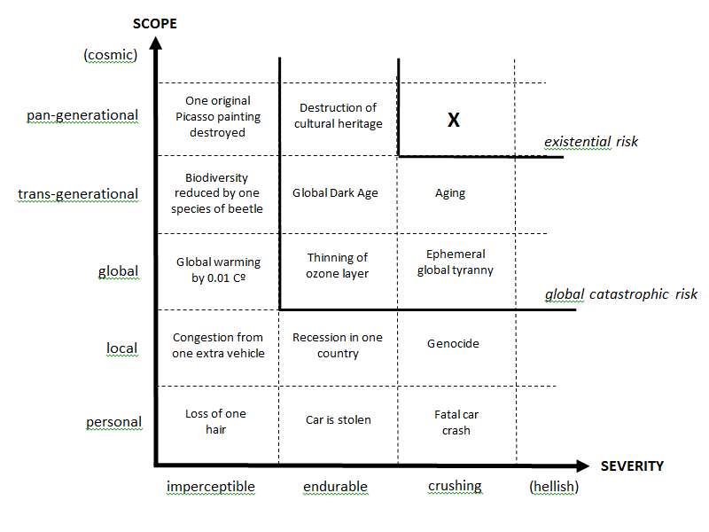
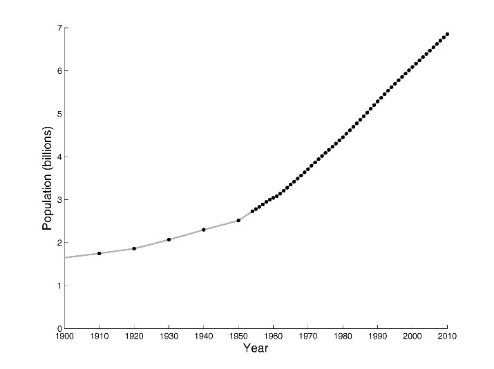

## Day 10 of Summarizing a Paper a Day: Existential Risk Part 1

### The maxipok rule

I think one of the things that people really don't want to think about is existential risk, or the existential wipeout of the human species. It's hard to think about all the complex factors here too and much easier to delegate responsibilities to researchers or alleviate guilt by saying "that's not my problem." However, I think it is an interesting (and very important) thing to work on.

The first claim here is that existential risk is more probable than we think. We are introducing "entirely new kinds of existential risk", such as technological innovations in artificial intellignence, biotechnology, and molecular nanotechnology. Our uncertainty and error-proneness assessment is also a much large factor because we are dealing in  low-probability high-consequence risks.

A good way to put this term existential risk more discretely is to categorize it by scope, severity, and probability. Here is what an example plot would look like.

But existential risk isn't even marginally close to events in history. In fact, if we plot the Earth's population size among time, you find that even the largest and most atracious distorical disasters like the world wars, holocaust, or covid hardly makes a dent in the population.

Thus, one way that I thought about this is that the assumed penalty here is linear, but in fact it should be log. To put an example to this, consider three outcomes:

1. Peace
2. A nuclear war that kills 99% of the world's population
3. A nuclear war that kills 100%

We know that they are in order of increasing severity, but how would you compare the "difference" between outcomes 1 and 2 and outcomes 2 and 3.

The point here is that the difference between 2 and 3 is actually much larger than 1 and 2, which I would assume most people would think. We can make up the world again with 1% of the population, but to wipe out the whole population would be to destroy any chance at repopulation. Now, let's try to calculate this value. 

**Note**: Ok this is a part I find actually questionable, but their math goes along the lines of:

Let's assume 1 billion more years of society, 1 billion people, 100 year lifespan, so $10^{16}$ human lives. That ignores how many descendants we could have in total though, so an estimate based on current cosmological estimates is $10^{34}$ years. An estimate by Bostrom in 2003 goes further under the belief that future minds will utilize computational hardware instead of biological neuronal weware, giving a final estimate of $10^{54}$ human-brain-emulation. 

The final conclusion here though, which I beleive, is that "even using the most conservative of these estimates, ... this implies that the expected value of reducing existential risk by just one millionth of 1% is equal to 100 million human lives."  Even a small, marginal output on the probability of existential risk would be compounded throughout the hopefully many years later of human civilization. It is possibly even more important than the direct benefit of saving 1 billion lives today.

The interpretation that follows is to maxinimize "OK" outcomes that avoids catastrophe at all costs. Or choose the action that has the best worst-case outcomes. 

### Classification of Existential Risk

Let's be more specific about how we define existential risk. They compartmentalize it into four classes:
1. Human extinction - Goes extinct prematurely
2. Permant stagnation - Survives but never reaches technological maturity
3. Flawed realization - Reaching technological maturity, but in a dismal manner
4. Subsequent ruination - Technological maturity that gives subsequent ruinous developments despite possiblity of good future prospects

Technological maturity is used here to refer to attainment of attainment of capabilities affording a level of economic productivity and control over nature close to the maximum that could feasibly be achieved.

Following, these classes are described in detail and possible scenarios are played out. I think its interesting to reflect here on how we want the future of society to play out. An extreme nihlist may just proclaim to burn the whole society down and minimize human suffering. Are we optimizing here for happiness? Or for technological innovation output and realization of human potential? Seems ironically similar to the meaning of human life.

It definitely is an interesting article and I am definitely surprised by how well put together it is and how concretely formulated something in my eyes was quite abstract. 