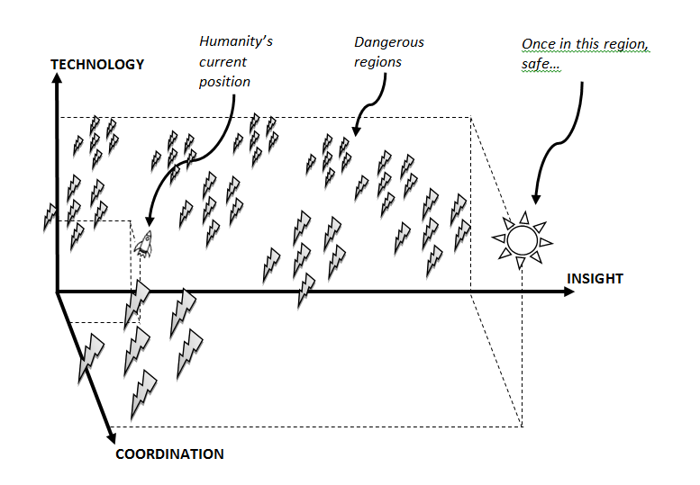
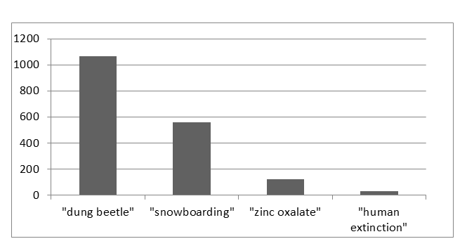

- [Day 11 of Summarizing a Paper a Day: Existential Risk Part 2](#day-11-of-summarizing-a-paper-a-day-existential-risk-part-2)
  - [3. Capability and Value](#3-capability-and-value)
    - [3.3. Existential Risk and Normative Uncertainty](#33-existential-risk-and-normative-uncertainty)
  - [4. Outlook](#4-outlook)

## Day 11 of Summarizing a Paper a Day: Existential Risk Part 2

This is part 2. Read part 1 [here](https://github.com/echen333/Paper_A_Day/blob/master/09-18%20Existential%20Risk.md). Shorter paper today, too.

### 3. Capability and Value

This paper seems very optimistic about the future of earth-dwelling humanity. In section 3.1, they talk about maximizing long-term efficency and productivity on the order of billions of years. That would be $10^5$ times longer than modern society. I quote, "it might turn out that the ideal way to use most of the **cosmic endowment** that humanity could eventually secure is to postpone consumption for as long as possible."

#### 3.3. Existential Risk and Normative Uncertainty

I alluded to this yesterday, but there are very important questions that come up when deciding what the future of our society *should* look like. Even the optimal answer to population ethics (e.g. population size, inequality, thresholds for what counts as a life worth living) will most likely not be the answer in the future. Thus, there is this [normative uncerntainty](https://www.youtube.com/watch?v=yf9GljlqjI4&ab_channel=CentreforEffectiveAltruism) is at play. With larger intelligence, coordination, and insight, though, we attempt to minimize this uncertainty.

An interesting observation to make here though is that greater technology is not necessarily better. Technology with sufficient insight and coordination can spell danger, such as was almost the case in the atomic bomb.

### 4. Outlook

Despite being both a very high moral and ethical concern, there is still a long way to go in the field of existential risk. In academia, it receives far less attention than other topics that can we can confidently say are less important. Here is graph of the number of paper citations by topic:

Part of this difficulty is its deep abstractness and epistomological challenges. Human knowledge is still deeply contained and who knows what we could possibly know. It is also inherently both a global public good and transgenerational; there is no product to sell here and solving it here is almost exclusively based on altruism. This could be facilitated by institutional innovations (e.g. prediction markets, science+philosophy education improvements) or much worse, a major, non-existential catastrophe, highlighting the fragility of human existence.
