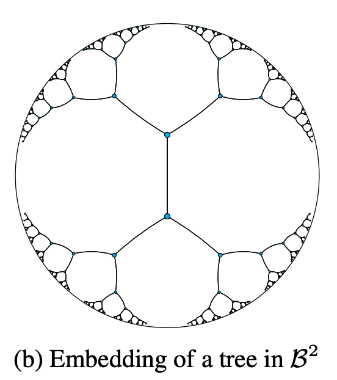
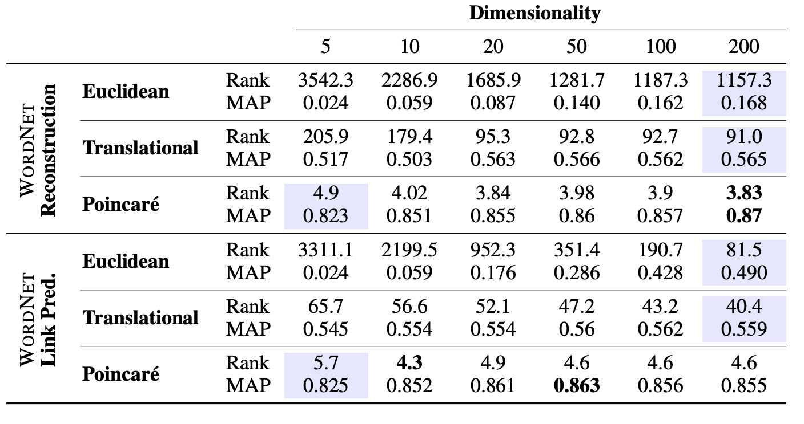
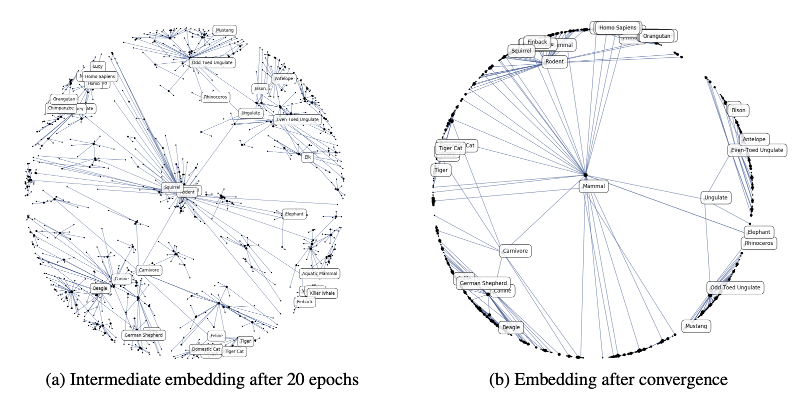

- [Introduction](#introduction)
- [Embeddings and Hyperbolic Geo](#embeddings-and-hyperbolic-geo)
- [Poincaré Embeddings](#poincaré-embeddings)

Note: Special thanks to [Owen Oertell](https://owenoertell.net/) for the paper recommendation!

## Introduction

Some of the most exciting Machine Learning models today are in processing high level symbolic data such as images and large amounts of text. This paper introduces using Poincare Embeddings to more efficiently represent this data and how to encode high level data in machine learning models. Termed embeddings, they are used to translate image, text, and graph data to ML-applicable data that don't lose their inherit properties. For example, images lose out on the locality property, where heavier emphasis is placed on pixels closer to each other, when translated into pixels into a 1d array.

One of the problems with modern embedding applications though is their inability to deal with high order dimension data e.g. large graph structures. This paper introduces using the Poincaré ball model to utilize the fact that [continous trees](https://www.geeksforgeeks.org/continuous-tree/) can be embedded into a finite hyperbolic space.

## Embeddings and Hyperbolic Geo

Hyperbolic space (distance $\ne$ Euclidean distance) is helpful because it allows the modelling of exponential growth rates in space and is perfect for modelling something like where the # of nodes at level $l$ of a tree is $k^l$. This is due to the negative curvature in space, where distance grows exponentially as you approach the border of the circle. Think of it as looking down on a sphere - the many points on the circumference look infinitely close to each other, but make it a very morphed sphere. This fits perfectly in power-law distributions, already seen helpful in things like natural language and greedy routing in geography ([Kleinberg](https://en.wikipedia.org/wiki/Small-world_routing)).

## Poincaré Embeddings

More specfiically, we can describe the Poincare ball model in relation to the Riemannian manifold: $$g_x=(\frac{2}{1-||x||^2})^2g^E$$ where $x\in \beta^d$ and $g^E$ denotes the Euclidean [metric tensor](https://www.youtube.com/watch?v=Hf-BxbtCg_A&ab_channel=Dialect). Notice how as ||x|| approaches 1, $g_x$ scales by a factor quickly approaching to infinity. The distance formula follows by plugging $u$,$v$ and using properties of manifolds: $$d(u,v) = cosh^{-1}(1+2\frac{||{u}-{v}||^2}{(1-||{u}^2||)(1-||v||^2)})$$

Now, to translate $S={\{x_i\}}_{i=1}^n$, for a given problem-specific loss function, we attempt to minimize: $$\Theta'\leftarrow argmin_\Theta L(\Theta)$$

Optimizations for finding this follow in section 3.1. Intuitively, they also use gradient descent just like in neural networks attempting to minimize loss functions. The gradient is a little different though in hyperbolic space, where $$\nabla = \frac{\partial{\mathcal{L(\theta)}}}{\partial{d(\theta,x)}}\frac{\partial{d(\theta,x)}}{\partial\theta}$$

In each iteration, move point $x_i$ in the direction of this gradient. An interesting observation to be made also is constraining embeddings to ensure computers can still easily compute calculations. They use the projection: $$proj(\theta) = ||\theta||\ge1? \frac{\theta}{||\theta||}-\epsilon:\theta$$
where $\epsilon=10^{-5}$. This is to remove points too quickly converging or having precision errors. 

For training details, see section $3.2$ and $4$, but it is interesting to see that Poincaré embeddings can already greatly reduce dimensionality in large-scale data. We see that compared to traditional Euclidean embeddings, Poincaré embeddings can logarithimically decrease dimension size.  

